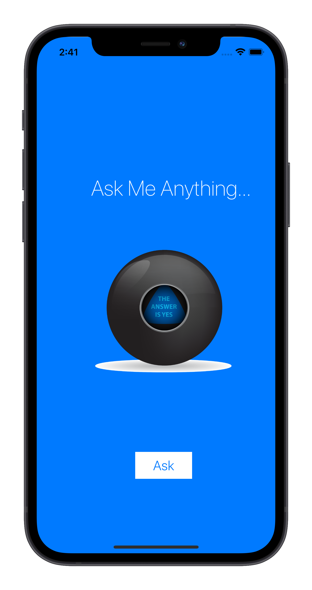

<h1>magic-8-ball</h1>

<p>An app developed in Swift that displays a magic ball according to a user's question.</p>

## About

This was an application designed to practice the basics of Swift.

## Screenshots



## Technologies

- [Swift](https://swift.org/)

## What I learned with this app

- Design user interface;
- Changing UI Elements programmatically;
- Detect user interaction and respond to it;
- Learn to use Swift variables and Arrays to store data;
- Learn about randomisation in Swift;

## How to Install

```bash
# Clone this repository
git clone git@github.com:lucalves/magic-8-ball.git

# Go into the repository
cd magic-8-ball

# Open the repository in the IDE (If you use VS Code)
code .

# Just run the app on XCode!
```

